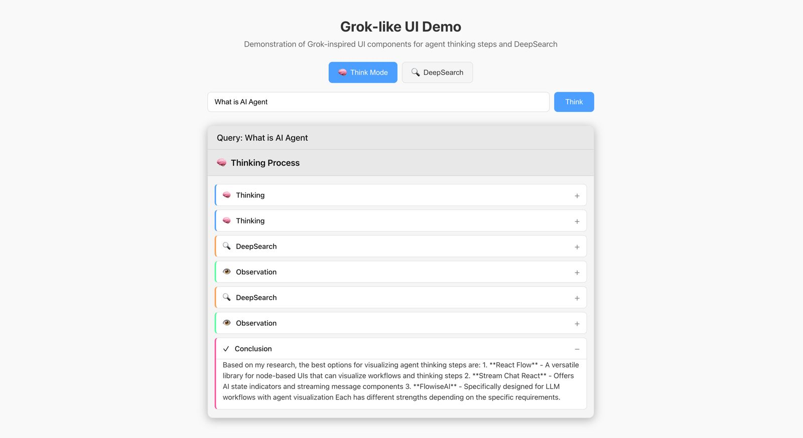

# Grok-like React UI Components

A collection of React components that mimic Grok's UI for displaying agent thinking steps and search results.

## Components Overview

This library provides React components that replicate the Grok UI experience for:
- Agent thinking steps with expandable sections
- DeepSearch results with source cards and summaries

## Screenshots

### Thinking Steps Component


The GrokThinkingSteps component displays the agent's thinking process with expandable sections for different types of steps:
- Thinking steps (brain icon)
- DeepSearch steps (magnifying glass icon)
- Observation steps (eye icon)
- Conclusion steps (checkmark icon)

Each step can be expanded to show more details, and the component animates as new steps are added.

### DeepSearch Component


The DeepSearch component shows search results with:
- Progress indicator
- Source cards with favicons
- Snippets from sources
- Summary of findings

## Real LLM Example

Here's how the components would display a real LLM's thinking process for the query "What are the environmental impacts of electric vehicles?":

```jsx
const thinkingSteps = [
  {
    type: 'thinking',
    content: `To answer this question about environmental impacts of electric vehicles (EVs), I need to consider multiple factors:
1. Manufacturing impacts
2. Energy source for charging
3. Battery production and disposal
4. Comparison with conventional vehicles
5. Lifecycle assessment

Let me search for some reliable information on these aspects.`
  },
  {
    type: 'search',
    content: 'Searching for information on environmental impacts of electric vehicles...',
    sources: [
      { 
        title: 'Environmental impacts of electric vehicles - Wikipedia', 
        url: 'https://en.wikipedia.org/wiki/Environmental_impacts_of_electric_vehicles' 
      },
      { 
        title: 'Are Electric Cars Really Better for the Environment?', 
        url: 'https://www.epa.gov/greenvehicles/electric-vehicle-myths' 
      }
    ]
  },
  {
    type: 'observation',
    content: `From my search, I've found several key points about EV environmental impacts:

1. Manufacturing: EV production typically has higher environmental impacts than conventional vehicles, primarily due to battery manufacturing.

2. Energy Sources: The environmental benefits of EVs depend heavily on the electricity source used for charging. Renewable energy sources maximize benefits, while coal-powered electricity reduces advantages.

3. Battery Production: Lithium-ion battery production requires mining of lithium, cobalt, and nickel, which has environmental and social impacts.

4. Emissions: EVs produce zero tailpipe emissions, reducing local air pollution in urban areas.

5. Lifecycle Assessment: When considering the entire lifecycle, EVs typically have lower greenhouse gas emissions than conventional vehicles, even with current electricity mixes in most countries.`
  },
  {
    type: 'search',
    content: 'Searching for specific data on lifecycle emissions comparison...',
    sources: [
      { 
        title: 'Lifecycle Analysis of Electric Vehicles - MIT Energy Initiative', 
        url: 'https://energy.mit.edu/research/mobilityofsustainability/lifecycle-emissions-of-electric-cars/' 
      },
      { 
        title: 'Electric vehicle life cycle analysis and raw material availability - European Environment Agency', 
        url: 'https://www.eea.europa.eu/publications/electric-vehicles-from-life-cycle' 
      }
    ]
  },
  {
    type: 'observation',
    content: `The lifecycle analysis studies provide quantitative data:

1. A typical EV today produces about 50% less lifecycle greenhouse gas emissions than an average gasoline car over 15 years of use in the United States.

2. The "carbon payback period" (time needed for an EV to overcome its higher manufacturing emissions) is typically 6-18 months depending on the electricity mix, driving patterns, and vehicle models compared.

3. Battery recycling technologies are improving, with potential to recover up to 95% of key materials, reducing the environmental impact of battery production.

4. EVs have significantly lower operating emissions, but manufacturing emissions are 1.5-2x higher than conventional vehicles.`
  },
  {
    type: 'conclusion',
    content: `Based on my research, the environmental impacts of electric vehicles include:

**Positive Impacts:**
- Zero tailpipe emissions, reducing urban air pollution
- Lower overall lifecycle greenhouse gas emissions (typically 50% less than gasoline vehicles)
- Potential to be powered by renewable energy, further reducing emissions
- Improving battery recycling technologies

**Negative Impacts:**
- Higher manufacturing emissions, particularly from battery production
- Environmental and social concerns with mining battery materials
- Dependent on electricity grid mix for charging (coal-powered electricity reduces benefits)
- Current challenges with battery recycling infrastructure

Overall, electric vehicles generally offer environmental benefits compared to conventional vehicles, especially as electricity grids become cleaner and battery technology and recycling improves. However, the full environmental benefits depend on factors like electricity source, vehicle lifetime, and driving patterns.`
  }
];
```

This example demonstrates how the GrokThinkingSteps component can visualize the LLM's reasoning process, from initial thinking and information gathering to forming observations and reaching a conclusion.

### DeepSearch Example

Here's how the DeepSearch component would display search results for the query "Latest advancements in quantum computing":

```jsx
const searchSources = [
  {
    title: "IBM Unveils 1,000+ Qubit Quantum Processor",
    url: "https://research.ibm.com/blog/ibm-quantum-condor-processor",
    domain: "research.ibm.com",
    favicon: "https://research.ibm.com/favicon.ico",
    snippet: "IBM has announced its latest quantum processor, codenamed 'Condor', featuring over 1,000 qubits. This milestone represents a significant advancement in quantum computing hardware, potentially enabling more complex quantum algorithms and bringing practical quantum advantage closer to reality."
  },
  {
    title: "Quantum Error Correction Breakthrough Achieved",
    url: "https://www.nature.com/articles/s41586-023-06096-3",
    domain: "nature.com",
    favicon: "https://www.nature.com/favicon.ico",
    snippet: "Researchers have demonstrated a practical implementation of quantum error correction that significantly reduces decoherence in quantum systems. This advancement addresses one of the major challenges in building reliable quantum computers by protecting quantum information from environmental noise."
  },
  {
    title: "Google Claims Quantum Supremacy with Time Crystals",
    url: "https://ai.googleblog.com/2023/quantum-computing-time-crystals",
    domain: "ai.googleblog.com",
    favicon: "https://ai.googleblog.com/favicon.ico",
    snippet: "Google's quantum AI team has successfully created time crystals using their quantum processors. This exotic phase of matter, which appears to violate fundamental laws of physics, could potentially be used for extremely stable quantum memory and more efficient quantum computing architectures."
  },
  {
    title: "Quantum Machine Learning Shows Promise in Drug Discovery",
    url: "https://www.science.org/doi/10.1126/science.abg3989",
    domain: "science.org",
    favicon: "https://www.science.org/favicon.ico",
    snippet: "A new study demonstrates how quantum machine learning algorithms can accelerate drug discovery processes. By leveraging quantum computing's ability to efficiently model molecular interactions, researchers were able to identify potential drug candidates for complex diseases significantly faster than conventional methods."
  }
];

const searchSummary = `Recent advancements in quantum computing span hardware, error correction, and applications:

1. Hardware improvements have pushed beyond the 1,000 qubit threshold, with IBM's Condor processor leading the way.

2. Quantum error correction has seen practical implementations that significantly reduce decoherence, addressing a key challenge in building reliable quantum computers.

3. Novel quantum phenomena like time crystals are being explored for quantum memory and computing architectures.

4. Applied quantum computing is showing promise in fields like drug discovery, where quantum machine learning algorithms can model molecular interactions more efficiently than classical computers.

These developments suggest quantum computing is progressing toward practical applications, though challenges in scalability and error rates remain.`;
```

This example shows how the DeepSearch component can display search results with source information, snippets, and a summary of findings.

### Component Descriptions

#### GrokThinkingSteps Component
The GrokThinkingSteps component displays the agent's thinking process with expandable sections for different types of steps.

#### DeepSearch Component
The DeepSearch component shows search results with:
- Progress indicator
- Source cards with favicons
- Snippets from sources
- Summary of findings

#### Theme Support
The components automatically adapt to light and dark mode based on system preferences, but you can also customize the colors using CSS variables.

## Features

- **GrokThinkingSteps**: A component that displays agent thinking steps in a Grok-like UI
  - Shows expandable thinking steps with different types (thinking, search, observation, conclusion)
  - Animated appearance of steps
  - Loading indicators
  - Expandable/collapsible sections

- **DeepSearch**: A component that mimics Grok's DeepSearch feature
  - Progress bar for search progress
  - Source cards with favicons and snippets
  - Summary section
  - Animated search indicators

- **Dark/Light Mode Support**: Automatically adapts to system preferences
- **Responsive Design**: Works on different screen sizes

## Installation

```bash
# Clone the repository
git clone https://github.com/yourusername/grok-react-ui.git

# Navigate to the project directory
cd grok-react-ui

# Install dependencies
npm install

# Start the development server
npm start
```

## Integrating into Your Project

There are several ways to integrate these components into your own React project:

### Copy Components (Simplest)

1. Copy the component files you need from the `src/components` directory:
   - For thinking steps: `GrokThinkingSteps.jsx` and `GrokThinkingSteps.css`
   - For deep search: `DeepSearch.jsx` and `DeepSearch.css`

2. Place them in your project's components directory

3. Import and use them as shown in the Usage section below


### CSS Integration

These components use their own CSS files. Make sure to:

1. Import the CSS files alongside the components
2. Check for any CSS conflicts with your existing styles
3. The components use CSS variables for theming - you can override these in your project's root CSS

```css
:root {
  --grok-primary-color: #8c61ff;
  --grok-background-color: #121212;
  --grok-text-color: #ffffff;
  /* Override other variables as needed */
}
```

## Dependencies and Requirements

These components have minimal dependencies to make integration easier:

- React 16.8+ (uses hooks)
- React DOM 16.8+
- Modern browser support (uses CSS variables and modern JavaScript features)

No additional libraries are required for the core functionality. The components are:

- Framework-agnostic (works with Next.js, Create React App, Vite, etc.)
- Styling-framework independent (uses plain CSS, no dependencies on styled-components, Tailwind, etc.)
- State-management independent (manages internal state with React hooks)

If you're using TypeScript, you may want to create type definitions for the components.

## Usage

### GrokThinkingSteps Component

```jsx
import GrokThinkingSteps from './components/GrokThinkingSteps';
import './components/GrokThinkingSteps.css';

function YourComponent() {
  const [thinkingSteps, setThinkingSteps] = useState([
    {
      type: 'thinking',
      content: 'Analyzing the user query...'
    },
    {
      type: 'search',
      content: 'Searching for relevant information',
      sources: [
        { title: 'Source 1', url: 'https://example.com' },
        { title: 'Source 2', url: 'https://example.org' }
      ]
    },
    {
      type: 'observation',
      content: 'Found relevant information in the sources.'
    },
    {
      type: 'conclusion',
      content: 'Based on my analysis, the answer is...'
    }
  ]);

  return (
    <GrokThinkingSteps
      steps={thinkingSteps}
      isThinking={false}
      query="Original user query"
      onThinkComplete={() => console.log('Thinking complete')}
    />
  );
}
```

### DeepSearch Component

```jsx
import DeepSearch from './components/DeepSearch';
import './components/DeepSearch.css';

function YourComponent() {
  const [searchSources, setSearchSources] = useState([
    {
      title: 'Example Source',
      url: 'https://example.com',
      domain: 'example.com',
      snippet: 'This is a snippet from the source...'
    }
  ]);

  return (
    <DeepSearch
      query="Search query"
      sources={searchSources}
      isSearching={false}
      summary="Summary of search results..."
      onSearchComplete={() => console.log('Search complete')}
    />
  );
}
```

## Props

### GrokThinkingSteps Props

| Prop | Type | Description |
|------|------|-------------|
| `steps` | Array | Array of thinking steps |
| `steps[].type` | String | Type of step ('thinking', 'search', 'observation', 'conclusion') |
| `steps[].content` | String | Content of the step |
| `steps[].sources` | Array | Optional array of sources for search results |
| `steps[].isLoading` | Boolean | Whether the step is loading |
| `isThinking` | Boolean | Whether the agent is currently thinking |
| `query` | String | The original query |
| `onThinkComplete` | Function | Callback when thinking is complete |

### DeepSearch Props

| Prop | Type | Description |
|------|------|-------------|
| `query` | String | The search query |
| `sources` | Array | Array of sources found |
| `sources[].title` | String | Title of the source |
| `sources[].url` | String | URL of the source |
| `sources[].domain` | String | Domain of the source |
| `sources[].snippet` | String | Snippet from the source |
| `sources[].favicon` | String | Optional URL to the favicon |
| `isSearching` | Boolean | Whether the search is in progress |
| `summary` | String | Summary of the search results |
| `onSearchComplete` | Function | Callback when search is complete |

## Integration with AI Agents

These components are designed to be easily integrated with AI agents to visualize their thinking process and search results. Here's how you can connect them to your agent:

### For Thinking Steps

Each time your agent performs a reasoning step, tool call, or makes an observation, add a new step to the `thinkingSteps` array with the appropriate type.

```jsx
// When your agent starts a new thinking step
addThinkingStep({
  type: 'thinking',
  content: 'Analyzing the user query...'
});

// When your agent searches for information
addThinkingStep({
  type: 'search',
  content: 'Searching for relevant information',
  sources: [
    { title: 'Source 1', url: 'https://example.com' }
  ]
});

// When your agent makes an observation
addThinkingStep({
  type: 'observation',
  content: 'Found relevant information in the sources.'
});

// When your agent reaches a conclusion
addThinkingStep({
  type: 'conclusion',
  content: 'Based on my analysis, the answer is...'
});
```

### For DeepSearch

When your agent performs research or retrieval, add each source to the `searchSources` array as they're discovered.

```jsx
// When your agent finds a new source
addSearchSource({
  title: 'Example Source',
  url: 'https://example.com',
  domain: 'example.com',
  snippet: 'This is a snippet from the source...'
});

// When your agent completes the search
setSearchSummary('Summary of all findings...');
```

### Integration with Real LLM APIs

Here's an example of integrating the GrokThinkingSteps component with OpenAI's API to visualize the thinking process:

```jsx
import React, { useState, useEffect } from 'react';
import GrokThinkingSteps from './components/GrokThinkingSteps';
import './components/GrokThinkingSteps.css';
import OpenAI from 'openai';

const openai = new OpenAI({
  apiKey: process.env.REACT_APP_OPENAI_API_KEY,
});

function AIAssistant() {
  const [query, setQuery] = useState('');
  const [thinkingSteps, setThinkingSteps] = useState([]);
  const [isThinking, setIsThinking] = useState(false);

  const addThinkingStep = (step) => {
    setThinkingSteps(prev => [...prev, step]);
  };

  const handleSubmit = async (e) => {
    e.preventDefault();
    if (!query.trim()) return;
    
    setIsThinking(true);
    setThinkingSteps([]);
    
    // Add initial thinking step
    addThinkingStep({
      type: 'thinking',
      content: 'Analyzing your query: ' + query,
      isLoading: true
    });

    try {
      // Call OpenAI API with streaming
      const stream = await openai.chat.completions.create({
        model: 'gpt-4',
        messages: [
          { role: 'system', content: 'You are a helpful assistant. Think step by step.' },
          { role: 'user', content: query }
        ],
        stream: true
      });

      let fullResponse = '';
      
      // Update the thinking step as tokens come in
      for await (const chunk of stream) {
        const content = chunk.choices[0]?.delta?.content || '';
        fullResponse += content;
        
        // Update the current thinking step
        setThinkingSteps(prev => {
          const updated = [...prev];
          updated[0] = {
            ...updated[0],
            content: 'Analyzing your query: ' + query + '\n\n' + fullResponse,
            isLoading: false
          };
          return updated;
        });
      }
      
      // Add conclusion step
      addThinkingStep({
        type: 'conclusion',
        content: 'Based on my analysis: \n\n' + fullResponse
      });
      
    } catch (error) {
      console.error('Error calling OpenAI API:', error);
      addThinkingStep({
        type: 'observation',
        content: 'Error: ' + error.message
      });
    } finally {
      setIsThinking(false);
    }
  };

  return (
    <div className="ai-assistant">
      <form onSubmit={handleSubmit}>
        <input
          type="text"
          value={query}
          onChange={(e) => setQuery(e.target.value)}
          placeholder="Ask something..."
        />
        <button type="submit" disabled={isThinking}>Ask</button>
      </form>
      
      <GrokThinkingSteps
        steps={thinkingSteps}
        isThinking={isThinking}
        query={query}
        onThinkComplete={() => console.log('Thinking complete')}
      />
    </div>
  );
}

export default AIAssistant;
```

For more advanced integrations with tools and search capabilities:

```jsx
// Example of integrating with search tools
const performSearch = async (searchQuery) => {
  addThinkingStep({
    type: 'search',
    content: `Searching for: ${searchQuery}`,
    isLoading: true
  });
  
  try {
    // Call your search API
    const results = await searchAPI.search(searchQuery);
    
    // Format the results for the thinking step
    const sources = results.map(result => ({
      title: result.title,
      url: result.url,
      domain: new URL(result.url).hostname
    }));
    
    // Update the search step
    setThinkingSteps(prev => {
      const updated = [...prev];
      const searchIndex = updated.findIndex(step => 
        step.type === 'search' && step.isLoading);
      
      if (searchIndex >= 0) {
        updated[searchIndex] = {
          type: 'search',
          content: `Search results for: ${searchQuery}`,
          sources,
          isLoading: false
        };
      }
      
      return updated;
    });
    
    // Add observation based on search results
    addThinkingStep({
      type: 'observation',
      content: `Found ${results.length} results for "${searchQuery}". The most relevant information indicates that...`
    });
    
  } catch (error) {
    console.error('Search error:', error);
  }
};
```

## Troubleshooting

### Common Integration Issues

1. **CSS not loading properly**
   - Make sure you've imported the CSS files in your component
   - Check if your bundler is configured to handle CSS imports
   - If using CSS modules, you may need to adjust the import paths

2. **Component styling conflicts**
   - The components use CSS variables for theming. If you're seeing styling issues, check if your application is overriding these variables
   - You can use more specific CSS selectors to override component styles

3. **Animation performance issues**
   - The components use CSS animations which might be performance-intensive on lower-end devices
   - You can disable animations by adding `.no-animations` class to the parent container

4. **React version compatibility**
   - These components use React hooks and require React 16.8+
   - If you're using an older version of React, you'll need to refactor the components to class components

5. **Server-side rendering**
   - If using Next.js or another SSR framework, you might need to dynamically import the components to avoid hydration errors:
   ```jsx
   import dynamic from 'next/dynamic';
   
   const GrokThinkingSteps = dynamic(
     () => import('../components/GrokThinkingSteps'),
     { ssr: false }
   );
   ```

### Getting Help

If you encounter issues not covered here, please:
1. Check the GitHub issues to see if others have encountered the same problem
2. Open a new issue with a detailed description of your problem and steps to reproduce it

## Demo Application

This repository includes a demo application that showcases the components in action.

### Running the Demo

1. Clone the repository
2. Install dependencies: `npm install`
3. Start the development server: `npm start`
4. Open your browser to http://localhost:3000

### Using the Demo

The demo application allows you to:

1. Enter a query in the input field and click "Think" to see the thinking steps component
2. Click on the "DeepSearch" tab to see the DeepSearch component
3. Expand/collapse individual thinking steps by clicking on them
4. See different types of thinking steps (thinking, search, observation, conclusion)
5. View the demo in both light and dark mode (based on your system preferences)

### Demo Source Code

The demo application is implemented in `src/components/GrokDemo.jsx`. You can use this as a reference for how to integrate the components into your own application.

## License

MIT

## Contributing

Contributions are welcome! Please feel free to submit a Pull Request. 